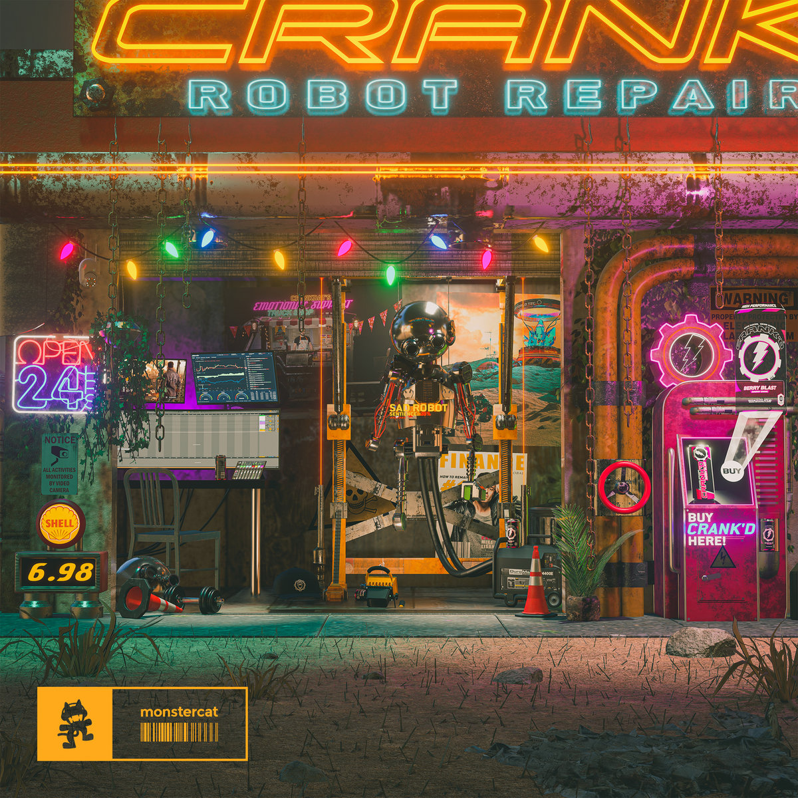

# Anything I Like Markdown Demo

## Tables
|VariabelA|VariabelB|
|---------|---------|
|False    |True     |
|Yes      |No       |
|Ja       |Nee      |
|Non      |Oui      |


|Patience|Annoyance|
|:------:|:-------:|
|100%    |0%       |
|75%     |25%      |
|50%     |50%      |
|25%     |75%      |
|0%      |100%     |


## Links

[Crankdat Album Picture "Sad Robot EP"](https://f4.bcbits.com/img/a3193404835_10.jpg)

[Markdown Documentation by HvA(I think)](https://iot.dev.hihva.nl/knowledgebase/documentation/markdown/)

[Beautiful page](./index.md)

[Links](##Links)

[Tables](##Tables)

## Images
||
|:-------------------------:|
|Sad Robot EP               |

||
|-----------------------------|
|Sad Robot EP but image on git|


## Code Blocks

```javascript
 let counter = 1;
    setInterval(() => {
        counter++;
        if (counter > 1) location.reload();
    }, 1000);
```

```Bash terminal
git add -A
git commit -m "blah blah"
```

```markdown
# Markdown showing 

## Chapter 1

Goodmorning everyone!
```

```cpp
#include <iostream>

int main() {
  std::cout << "Hello, World!"; 
  return 0;
```

## Videos


## Admonitions