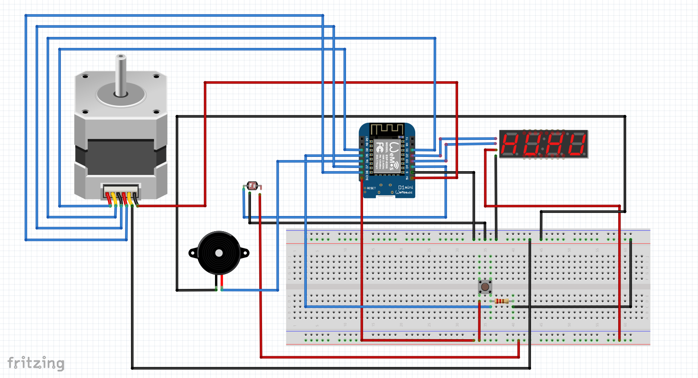

# Embedded device

## System Requirements

|Requirement ID#|Requirement|MoSCoW|Compliant|
|--|--|--|--|
|EMBRQ#01|Embedded device sends measured sensordata to the application backend over http or https.|MUST|YES/NO|
|EMBRQ#02|Embedded device receives or retrieves status messages from the application backend over http or https|MUST|YES/NO|
|EMBRQ#03|The embedded device contains at least two input sensors (e.g. LDR, buttons, joystick, capacitive touch, etc.).|MUST|YES/NO|
|EMBRQ#04|The embedded device contains at least two visual and/or sensory outputs (e.g. LED, LED Matrix, 7-segement display, motor, servo, actuator, LCD-screen, etc.).|MUST|YES/NO|
|EMBRQ#05|The embedded device uses the wifi manager for configuration of SSID, User ID (UID) en Password (PWD) for connecting to the network.|MUST|YES/NO|

### EMBRQ#01
[Insert text explaining how you fulfilled the requirement here]

Code:
[Insert code snippet(s) proving the requirement is fulfilled here]

### EMBRQ#02
[Insert text explaining how you fulfilled the requirement here]

Code:
[Insert code snippet(s) proving the requirement is fulfilled here]

### EMBRQ#03
I have two input sensors, a button and a ldr.

In the first set of code I show how I use the button to start a stopwatch function.

In the second set of code I show how I retrieve the sensordata from the ldr and return it. The sensordata is either a 1(detects no light) or a 0(detects light). 

Code:

```ino
if (digitalRead(BUTTON_STOPWATCH) == HIGH) {
    stopwatch();
}
```

```ino
int ldr() {
    int sensorData = digitalRead(LDR);
    Serial.print("Sensor value:");
    Serial.println(sensorData);
    delay(SECOND_DELAY);
    return sensorData;
}
```

### EMBRQ#04
I have two visual outputs, a 4-Digit Display and a stepper motor.

In the first set of code I am showing how I'm displaying the time on the 4-Digit Display where the inserted value is:

- ```int time```: the time that needs to be displayed.

In the second set of code I am showing how I am using the stepper motor where the inserted values are:

- ```double maxSpeed```: The maximum speed that the stepper motor can spin.
- ```double acceleration```: The increase of speed.
- ```int speed```: the (beginning) speed of the stepper motor.
- ```int destination```: the 'coördinates' of destination within the stepper motor.

Code:

```ino
TM1637Display display(CLK, DIO);

void displayTime(int time) {
    display.showNumberDecEx(time, COLON, true, FOUR_LENGTH, ZERO_LENGTH);
}
```

```ino
void stepMotor(double maxSpeed, double acceleration, int speed, int destination) {
    myStepper.setMaxSpeed(maxSpeed);
	    myStepper.setAcceleration(acceleration);
	    myStepper.setSpeed(speed);
	    myStepper.moveTo(destination);
    if (myStepper.distanceToGo() == 0) {
		myStepper.moveTo(-myStepper.currentPosition());
    }
	myStepper.run();
}
```

EMBRQ#05
[Insert text explaining how you fulfilled the requirement here]

Code:
[Insert code snippet proving the requirement is fulfilled here]

## Hardware overview

## Wiring diagram
Instead of using the WeMos D1 Mini, I am using the WeMos D1 Mini Pro.

Instead of using a 16-pin 4-Digits display, I am using a 4-pin 4-Digits display with the following pins:

- CLK (connected to pin D2)
- DIO (connected to pin D3)
- VCC (connected to 3.3V)
- GND (connected to GND)

The button is used to start and stop a timer. After the timer is stopped, the 4-Digit Display will start displaying the current time again. The button is connected to pin D5.

The ldr (Light-Dependent Resistor) has 2 different output values:

- 0 (detects light)
- 1 (does not detect light)

The ldr also has 4 pins:

- AO  (not connected)
- DO  (connected to pin D4)
- GND (connected to GND)
- VCC (connected to 5V)

I am using a passive buzzer.
The passive buzzer has 2 pins:

- VCC (connected to D6)
- GND (connected to GND)

The stepper motor in the image doesn't have a controller, but it does in my physical project.
The stepper motor is connected to 6 pins:

- IN1 (connected to D0)
- IN2 (connected to D1)
- IN3 (connected to D7)
- IN4 (connected to D8)
- GND (connected to GND)
- VCC (connected to 5V)

||
|:--:|
|My embedded set-up using the WeMos|

## Bill of Materials
|Part Number|Manufacturer|Description|Quantity|Price (incl VAT)|Subtotal (incl VAT)|Example URL|
|--|--|--|--|--|--|--|

## Arduino Code
[Arduino Code](https://gitlab.fdmci.hva.nl/IoT/2022-2023-feb-jun/individual-project/iot-orenda/-/blob/main/Arduino/main/main.ino)

I have 16 functions

```ino
void stopwatch()
```

It is a stopwatch that will display the amount of time passed at the end.

```ino
void dayOfTheWeek(int day)
```

Displays the current day of the week.

- ```int day```: the int of the received value of the day of the week.

```ino
void time()
```

Displays the time and checks if a certain amount of seconds has passed to display the day of the week when needed to or to check if it is the start of the minute to check if there is an appointment.

```ino
void apptCheck(String tune, int darkValue)
```

This checks if the user wants the buzzer to turn on when it's dark when there is an appointment or not.

- ```String tune```: The name of the tune/melody.
- ```int darkValue```: a 0 or 1 value where 0 = buzzer does not turn on in the dark and 1 = buzzer does turn on in the dark

```ino
String getData()
```

Gets either the "datetime" or "day_of_week" value from an api and returns it.

```ino
int getTime()
```

Removes the not needed information from the returned datetime value from the ```String getData()``` method to return the time.

```ino
int getSeconds()
```

Removes the not needed information from the returned datetime value from the ```String getData()``` method to return the seconds.

```ino
String getDate()
```

Removes the not needed information from the returned datetime value from the ```String getData()``` method to return the date.

```ino
void displayTime(int time)
```

This makes it so I don't have to format the display everytime I want to show the time on the 4-Digit Display.

- ```int time```: the current time value retreived from the api

```ino
void setBrightness()
```

This function changes the brightness of the 4-Digit Display depending on wether it is dark or not.

```ino
int ldr()
```

Reads out an ldr (Light-Dependent Resistor) where 0 = detects light and 1 = covered/no light.

```ino
void buzzer(String melodyName)
```

This plays a certain melody on the passive buzzer.

- ```String melodyName```: the name of the chosen melody

```ino
void stepMotor(double maxSpeed, double acceleration, int speed, int destination)
```

This starts the stepper motor and lets it spin to a certain point.

- ```double maxSpeed```: The maximum speed that the stepper motor can spin
- ```double acceleration```: The increase of speed
- ```int speed```: the (beginning) speed of the stepper motor
- ```int destination```: the 'coördinates' of destination within the stepper motor

```ino
void macAddress()
```

Gives me the MAC-address of my WeMos in case I accidentally fry it again.

```ino
void wifiManager()
```

A wifi manager function that stores wifi credentials that helps preventing you with openly putting your wifi credentials in your code.
[For a better explanation of the wifi manager](https://randomnerdtutorials.com/wifimanager-with-esp8266-autoconnect-custom-parameter-and-manage-your-ssid-and-password/)

```ino
String getApptInfo(String tuneOrDark)
```

This receives the appointment information from the api.php file and returns the wanted information based on the inserted string value.

- ```String tuneOrDark```: a String value where if ```tuneOrDark == "tune"``` it returns the appt_tune value and if ```tuneOrDark == "dark"``` it returns the appt_dark value.


## Links
[Tutorial 4-Digit Display V1.2](https://www.instructables.com/Tutorial-How-to-4-Digit-Display-Interface-With-Ard/)

[Tutorial ldr](https://www.electroduino.com/ldr-sensor-module-with-arduino-ldr-sensor-arduino-code/)

[Tutorial Stepper motor](https://lastminuteengineers.com/28byj48-stepper-motor-arduino-tutorial/)

[Buzzer melody](https://github.com/robsoncouto/arduino-songs)