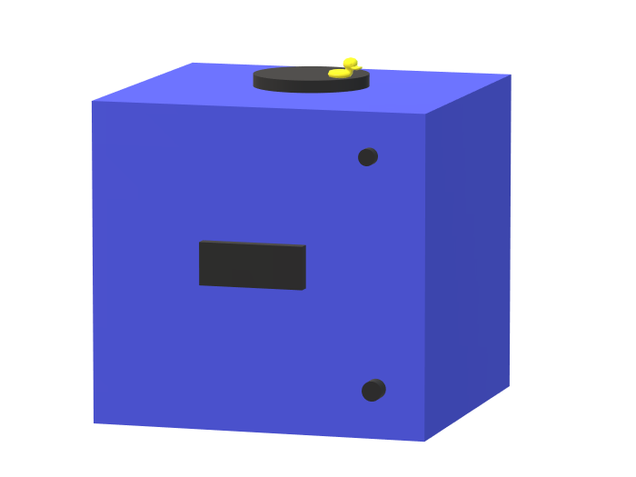

# Calender

The Calender will have several functions.

- Display the time.
- Play a tune using a buzzer to remind you of your appointment.
- Display the day of the week.
- Rotate the duck during the tune to remind you of the appointment.
- Being a stopwatch.

||
|:--:|
|Blueprint V1|

The blueprint consists of several parts.
 
- The black bar in the center: The 4-Digit Display to display the time and day of the week.
- The circle on top with a duck: A rotating platform using a stepper motor.
- The circle in the top-right in the front: The buzzer that plays a chosen melody when it's time for your planned appointment.
- The circle in the bottom-right in the front: The button that will start the stopwatch.