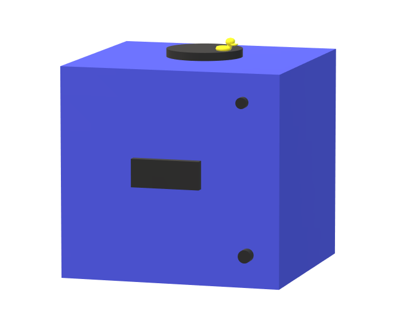

# Logbook IoT | Atilla Ören
On this page I will be updating what I have been doing day by day.
## Blueprint Week 1 
### 13 February 2023
I have started working with 2 different 4-Digit displays, one with 4 pins and one with 12 pins.
I have decided to use the one with 4 pins that I got from Miguel instead of the one with 12 pins which was provided with the kit.

||
|:--:|
|4-Digit Display V1.2|

### 14 February 2023
I have worked on being able to show the time on the 4-Digit Display and I got it to work. 
I have also made a timer method and a method to show the current day of the week after a specific amount of time.

||
|:--:|
|Embedded set-up 14 February 2023|

### 16 February 2023
Today I may have accidentally fried my WeMos, so I had to get a new one and solder it.
I have made a database design (see below) and I have further developed the stopwatch (earlier known as timer) method to also display the hours and time it recorded.

||
|:--:|
|Database Design|

## Blueprint Week 2
### 20 February 2023
Today I have added comments to my code. 
I also have removed the magic numbers.
I have made the connection with the database in php and I have added some documentation.

### 21 February 2023
Today I wanted to work on the website, but after an introduction from Gerald about feedback moments, I decided to clean up my arduino code.

I have split up 1 function (previously known as ```void time()```) into [8 different functions](https://iot.dev.hihva.nl/2022-2023-feb-jun/individual-project/iot-orenda/embedded_device/#code-4-digit-display).

I have added a ldr (Light-Dependent Resistor).

||
|:--:|
|Embedded set-up 21 February 2023|

### 23 February 2023
Today I have worked a bit on the website (test.php).
I made implemented an auto refresh for now and I am displaying the current time on the website.
I also have a better understanding of php.
I have fixed the errors in the main.ino file and I got rid of some duplicate code.

## Blueprint week 3
### 3 March 2023
Today I have worked on getting the passive buzzer to work.
It is working and I have also added 6 tunes that the user eventually can choose from.

||
|:--:|
|Embedded set-up 3 March 2023|

### 4 March 2023
Today I have worked on getting the stepper motor to work.
And it did work, to an extend.
I managed to get the stepper motor to turn clockwise, but i couldn't get it to work counter clockwise.
So I had decided to start using another method with the stepper motor by using the library called 'AccelStepper'.
I haven't been able to get the stepper motor to spin counter clockwise and after doing some research I still haven't found my answer.

||
|:--:|
|Embedded set-up 4 March 2023|

### 5 March 2023
Today I have worked a bit on the website.
I have followed the announcement that Mats had put about the tunnel.
I have changed the database design after receiving feedback from Mats and updated the sql file and documentation on the subject.

||
|:--:|
|Database design after feedback|

I have also made a rough design for the calendar.

||
|:--:|
|Blueprint design V1|

The blueprint consists of several parts.
 
- The black bar in the center: The 4-Digit Display to display the time and day of the week.
- The circle on top with a duck: A rotating platform using a stepper motor.
- The circle in the top-right in the front: The buzzer that plays a chosen melody when it's time for your planned appointment.
- The circle in the bottom-right in the front: The button that will start the stopwatch.

## Blueprint week 4
### 6 March 2023
Today I have made the addEvent.php page.

||
|:--:|
|addEvent.php page|

There are several values that can be inserted:

- Appointment name: The name of the appointment
- Date: The date of the appointment
- Select a time: The time of the appointment
- Extra context: Extra context for your own information
- Tune: The melody you want to be played for when it's time for your appointment

I chose for a simple design to make it easy to understand for the user.
I have also chosen to display the current time and date at the bottom of the page to make it easier for the user to pick a time and date that hasn't passed yet.

The page is front-end only for now. I don't have a lot of experience in webdevelopment so it's taking a little longer than I would like.

### 7 March 2023
Today I have made a database connection.
I am able to insert data into the [addEvent.php](https://gitlab.fdmci.hva.nl/IoT/2022-2023-feb-jun/individual-project/iot-orenda/-/blob/main/docker/web/addEvent.php) page, send it through to the [sendData.php](https://gitlab.fdmci.hva.nl/IoT/2022-2023-feb-jun/individual-project/iot-orenda/-/blob/main/docker/web/dataSend.php) page and from there send it to the database.

I am also able to retreive the stored information in the [index.php](https://gitlab.fdmci.hva.nl/IoT/2022-2023-feb-jun/individual-project/iot-orenda/-/blob/main/docker/web/index.php) page.
||
|:--:|
|index.php page|

### 9 March 2023
Today I have reformatted my code to properly distinguish the sending and retrieving of data from or to the database.
I have made a seperate connect.php file that connects to my database to get rid of some duplicated code.
I am now able to retrieve the appointments per date and all at once.

I just mostly worked on cleaning up my code and attempting to continue to work my way on being able to create posts using php.

## Blueprint week 5/Profile week 1
### 14 March 2023
Today I have had a lot of issues with the docker. I had to delete and install the docker several times, tried to find a fix on the internet, deleted several folders and restarted my laptop several times and after several hours of trying to get it to work, it finally worked.
I have been able to make a table of today's appointments/events using php to retrieve the data and put it into the table.
I have attempted to put a delete button into the function, but it hasn't been able to work yet.
I have also put all of the function of dataGet.php and dataSend.php into the same file named database.php to fix an error with the require function in php.

### 16 March 2023
For the last few days I haven't been feeling well, so I didn't get much work done.
Today I focused on putting the requirements of the embedded part into the embedded page, updated my website page to also fit the requirements.
I have done some research on retrieving data from the database on the wemos.

### 17 March 2023
I made an api.php file to print the appointments of the current day and tried retrieving it using the WeMos, without succes.

## Profile week 2
### 21 March 2023
Today I have gotten the api to work by json_encoding the array and also specifying the array number (0) in the arduino code. I have added an extra variable to the website and database called appt_dark for the user to decide on wether or not they want the buzzer to turn on in the dark or not.
I have made a new function called ```void apptCheck(String tune, int darkValue)``` to check if there is an appointment at the current date and current time, it also checks for the dark value and activates the buzzer if there is an appointment. 
I added a ```void setBrightness()``` function to changed the brightness of the 4-Digit Display depending on wether it's dark or not.