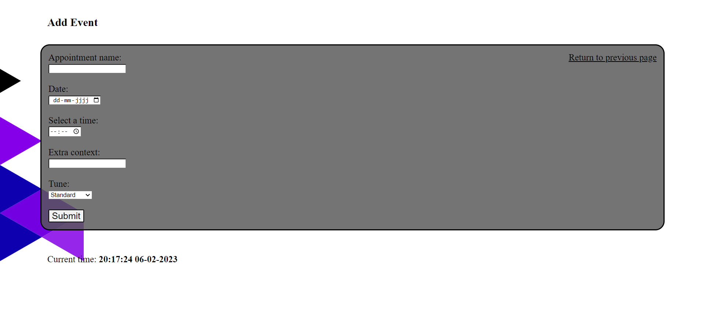

## Database Design
[Database Design download link](./database_design/IoT_orenda_database_design.sql)

[Database Design git link](https://gitlab.fdmci.hva.nl/IoT/2022-2023-feb-jun/individual-project/iot-orenda/-/blob/main/docs/database_design/IoT_orenda_database_design.sql)

||
|:--:|
|The Database Design|

I have made 1 table.

- appointments - To store the appointments with a given id, date, time, name, tune and text.
    - idappointments: an automatic incremented id to seperate the different appointments
    - appt_name: the name of the appointment
    - appt_date: the date of the appointment
    - appt_time: the time of the appointment
    - appt_context: extra information you want saved about the appointment
    - appt_tune: the tune/melody assigned to the appointment
    - appt_dark: wether or not you want the buzzer to go on in the dark

I chose for this set-up because I think that these 'subjects' are the only things that are needed to be saved/stored.

My peer partner is Luca de Rooij.

## Website Front-end
The purpose of my front-end website is to display the appointments that the user has.
I have also made a second page for the user to send the appointments to the database. I have chosen for a second page instead of a pop-up to make it easier for myself and to have a better overview of differences.

### index.php
[Link to index.php](https://gitlab.fdmci.hva.nl/IoT/2022-2023-feb-jun/individual-project/iot-orenda/-/blob/main/docker/web/index.php)

This page is meant to receive and display today's appointments that the user has stored.

||
|:--:|
|index.php page|

I chose for a simple design to display the necessary information about the appointment.
I have also chosen to display the current time and date so the user can compare the current time to the time of their next appointment.

### addEvent.php
[Link to addEvent.php](https://gitlab.fdmci.hva.nl/IoT/2022-2023-feb-jun/individual-project/iot-orenda/-/blob/main/docker/web/addEvent.php)

This page is used to insert the appointments into the database.

||
|:--:|
|addEvent.php page|

I chose for a simple design to keep it easy and simple for the user.
I also had decided to display the current time and date to make it easier for the user to pick a proper date and time that hadn't already passed.

## Website Back-end

### database.php
This php file has the functions that have anything to do with sending, deleting, getting and printing the appointments.

```php
function printTable($value)
```

This function prints the retrieved value into the table.

- ```$value```: the retrieved value that gets printed

```php
function selectAll()
```

This function selects all the data from the database and returns it.

```php
function selectOnDate($date)
```

This function receives the appointments where the date equals the date given.

- ```$date```: the date given to retreive appointments that match that date

```php
function send($appt_name, $appt_date, $appt_time, $appt_context, $appt_tune)
```

Where the inputted data will be send to the database. 
The inputted values are:

- ```$appt_name```: the name of the appointment
- ```$appt_date```: the date of the appointment
- ```$appt_time```: the time that the appointment is at
- ```$appt_context```: the context of the appointment 
- ```$appt_tune```: the tune/melody of the alarm

```php
function delete($appt_id)
```

Where the appointment with the inputted id will be deleted.
The inputted value is:

- ```$appt_id```: the id of the appointment

### connect.php
This file contains my database information and connects to the database.

### api.php
This file prints the data if there is an appointment at the current date and the current time for the wemos to get.